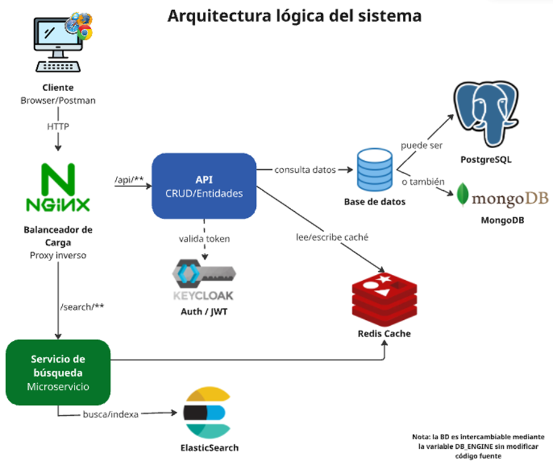
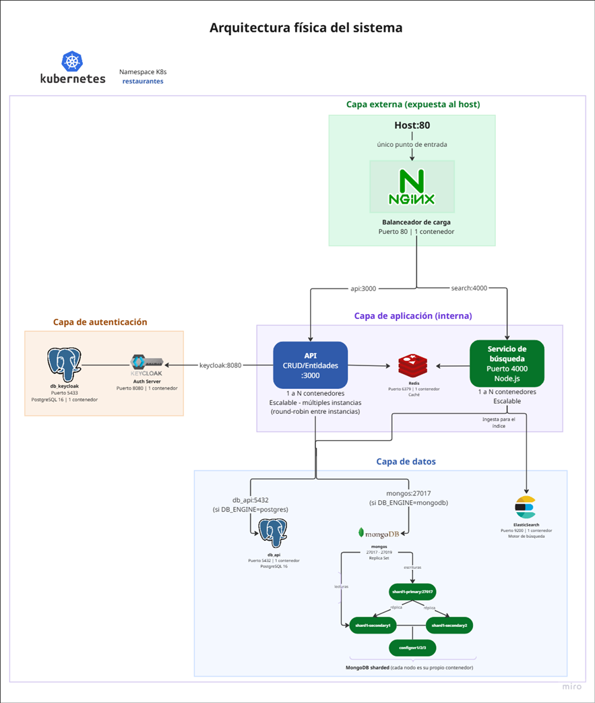

1.	Introducción
    El presente documento sirve como la documentación oficial del proyecto número 1 desarrollado en el curso de Bases de Datos II – el cual consiste en un sistema de Reserva Inteligente de Restaurantes.
    Los objetivos del proyecto son la incorporación de una arquitectura de microservicios con soporte para múltiples motores de base de datos, búsqueda avanzada, caché distribuida y balanceo de carga, además de un pipeline para ejecutar pruebas, construir imágenes Docker y almacenarlas en el Container Registry del repositorio. Esto se logra con las siguientes tecnologías: CI/CD para el pipeline, MongoDB con replicación y sharding, autenticación de usuarios con Keycloak, la base de datos PostgreSQL para almacenar los datos de Keycloak y también como posible base de datos para el proyecto (se puede elegir entre PostgreSQL y MongoDB), ElasticSearch como servidor de búsqueda, Redis como cache, Nginx como balanceador de carga y escalabilidad con Kubernetes. 
    Con este escrito, se pretende informar sobre las herramientas utilizadas en el proyecto, desde el diseño general del sistema, su arquitectura lógica y física, hasta los microservicios, sus responsabilidades, el flujo de datos y el uso del balanceador.
    Finalmente, cabe aclarar que el diseño sigue principios SOLID, el patrón DAO para la abstracción de la capa de datos y el patrón Strategy para la seleccionar de manera dinámica el motor de base de datos con variables de entorno y sin modificar código fuente. 
 
2.	Diseño general del sistema
    El sistema está diseñado siguiendo una arquitectura de microservicios, donde cada componente cumple una responsabilidad específica y se comunica a través de la red interna del clúster. Un balanceador de carga (Nginx) centraliza el acceso externo y enruta las solicitudes hacia los servicios correspondientes, mientras que mecanismos de autenticación, búsqueda y caché permiten mejorar la seguridad, el rendimiento y la escalabilidad del sistema. Este enfoque facilita el mantenimiento, la escalabilidad horizontal y la separación de responsabilidades.

    2.1.	Arquitectura lógica 
    En el siguiente diagrama (Figura 1), se muestra la arquitectura lógica del sistema, en donde se especifica qué componentes tiene el sistema y cómo se comunica, sin importar en qué máquinas corren.
    Figura 1. Diagrama de arquitectura lógica 

    El sistema está compuesto por dos microservicios independientes coordinados por un balanceador de carga Nginx:

    ●	CRUD/Entidades (API principal): gestiona todas las entidades del dominio: restaurantes, menús, usuarios, reservaciones y pedidos. Soporta PostgreSQL y MongoDB de forma intercambiable mediante el patrón DAO.
    ●	WS Search (microservicio de búsqueda): microservicio independiente que expone endpoints de búsqueda textual y por categoría usando ElasticSearch como motor de índice. 
    ●	Nginx: actúa como reverse proxy y balanceador de carga. Enruta las peticiones según el prefijo de la URL: /api/v1/ hacia la API principal y /search/ hacia el microservicio de búsqueda. 
    ●	Keycloak: Keycloak actúa como el servidor de autenticación y autorización del sistema. Se encarga del registro y login de usuarios, gestionando credenciales y roles dentro de su propio realm (restaurant) y emitiendo tokens JWT. La API no almacena contraseñas ni auténtica directamente a los usuarios; únicamente valida los JWT emitidos por Keycloak en cada petición protegida para identificar al usuario y verificar sus permisos.
    ●	Redis: capa de caché distribuida. La API almacena respuestas frecuentes de restaurantes y menús con políticas de expiración TTL (Time To Live) y eviction LRU (mecanismo de limpieza automático para cuando la memoria caché se llena). 

    2.2.	Arquitectura física 
    A continuación, la Figura 2 muestra cómo y dónde está desplegado el sistema realmente. El  backend se realiza con Node.js, donde se aplica la lógica de negocio. Todos los servicios corren como contenedores Docker orquestados con Docker Compose en una red interna compartida. La comunicación entre contenedores usa los nombres de servicio como hostname, nunca IPs directas. 
    
        Figura 2. Diagrama de arquitectura física del sistema

3.	Puertos expuestos al host:
    El sistema expone únicamente los servicios necesarios al host para garantizar seguridad y control de acceso.Nginx funciona como el punto de entrada principal para los clientes externos, mientras que Keycloak expone su consola y endpoints de autenticación mediante port‑forwarding. El resto de los servicios permanecen internos al clúster de Kubernetes, siendo accesibles sólo entre los propios componentes del sistema. Ver tabla 1 para conocer los puertos expuestos al host.
    | Contenedor       | Puerto interno | Puerto host | Descripción                          |
    |------------------|---------------:|------------:|---------------------------------------|
    | nginx            | 80             | 80          | Punto de entrada único                |
    | api              | 3000           | Interno     | API CRUD (escalable)                  |
    | search-service   | 4000           | Interno     | Microservicio de búsqueda             |
    | keycloak         | 8080           | 8080        | Consola de administración             |
    | db_api           | 5432           | 5435        | PostgreSQL — datos API                |
    | db_keycloak      | 5432           | 5433        | PostgreSQL — Keycloak                 |
    | mongo1           | 27017          | 27017       | MongoDB primario                      |
    | mongo2           | 27017          | 27018       | MongoDB secundario 1                  |
    | mongo3           | 27017          | 27019       | MongoDB secundario 2                  |
    | redis            | 6379           | 6379        | Caché Redis                           |
    | elasticsearch    | 9200           | 9200        | Motor de búsqueda                     |
    Tabla 1. Puertos expuestos al host | Docker Compose

    En la siguiente tabla (Tabla 2), se muestran los servicios del sistema, su descripción con su respectivo acceso:
    | Servicio           | Acceso                                                           |   Descripción                     |
    |----------------------------------------------------------------------------------------------------------------------------|
    | Nginx-service      | http://localhost                                                | Punto de entrada único — enruta /api/** y /search/** |
    | Keycloak-service   | http://localhost:9999                                           |                                                      |
    |                    |  (via kubectl port-forward svc/keycloak-service 9999:8080)      | Consola y endpoint de tokens                         |
    | Todos los demás    | Internos al cluster                                             | Accesibles solo dentro de K8s                        |
    Tabla 2. Puertos expuestos al host | Docker Compose

4.	Volúmenes persistentes:
    Los datos se persisten en volúmenes Docker nombrados para sobrevivir reinicios:
    | Volumen           | Montado en                          | Servicio        |
    |-------------------|-------------------------------------|-----------------|
    | pgdata_api        | /var/lib/postgresql/data            | db_api          |
    | pgdata_keycloak   | /var/lib/postgresql/data            | db_keycloak     |
    | mongo1_data       | /data/db                            | mongo1          |
    | mongo2_data       | /data/db                            | mongo2          |
    | mongo3_data       | /data/db                            | mongo3          |
    | redis_data        | /data                               | redis           |
    | es_data           | /usr/share/elasticsearch/data       | elasticsearch   |
    Tabla 3. Volúmenes persistentes | Docker Compose

    En la siguiente tabla se muestran los datos que persisten en volúmenes persistentes nombrados en Kubernetes para sobrevivir reinicios:
    | PVC                         | Montado en                         | Servicio                |
    |-----------------------------|------------------------------------|-------------------------|
    | configsrv-data-configsvr-0  | /data/configdb                     | MongoDB config server   |
    | shard-data-shard-0          | /data/db                           | MongoDB shard           |
    | es-data-elasticsearch-0     | /usr/share/elasticsearch/data      | ElasticSearch           |
    | redis-pvc                   | /data                              | Redis                   |
    | keycloak-postgres-data      | /var/lib/postgresql/data           | PostgreSQL de Keycloak  |
    | keycloak-postgres-0         |
    Tabla 4. Volúmenes persistentes | Kubernetes (PVCs)

5.	Microservicios y sus responsabilidades 
    El sistema está construido bajo una arquitectura de microservicios, en la cual cada servicio es independiente y cumple una función específica dentro del conjunto del sistema. Este enfoque permite una mejor separación de responsabilidades, facilita el mantenimiento del código y posibilita que cada componente pueda escalar o actualizarse de manera aislada sin afectar al resto del sistema. A continuación se describen los microservicios de nuestro sistema. 

    5.1.	CRUD/Entidades — API Principal:

    Tecnología: Node.js 20, Express 5, PostgreSQL 16, MongoDB 7
    Puerto interno: 3000
    Imagen docker: ghcr.io/adrian-mora-05/tareacorta1-basesii:latest 
    Escalabilidad: Horizontal mediante --scale api=N con Nginx como balanceador 
    Autenticación: JWT validado contra Keycloak en cada petición protegida 
    Base de datos: Seleccionable vía variable DB_ENGINE=postgres|mongodb 
    Responsabilidades:
    ●	Gestión completa (CRUD) de restaurantes, menús, usuarios, reservaciones y pedidos.
    ●	Autenticación y registro de usuarios a través de Keycloak usando OAuth2/OIDC.
    ●	Abstracción del motor de base de datos mediante el patrón DAO y DAOFactory.
    ●	Caché de respuestas frecuentes en Redis con políticas TTL e invalidación por evento.
    ●	Exposición de API REST documentada con Swagger en /api/docs.
    Estructura interna (patrón DAO): 
    Controller → Service → DAOFactory → DAO (Postgres | MongoDB) 
    El DAOFactory es el único punto del sistema donde se evalúa DB_ENGINE. Los servicios reciben el DAO ya instanciado sin saber si viene de PostgreSQL o de MongoDB.
    | Método  | Ruta                     | Rol requerido | Descripción                     |
    |--------:|--------------------------|---------------|---------------------------------|
    | POST    | /api/auth/register       | Público       | Registro de usuario             |
    | POST    | /api/auth/login          | Público       | Login y obtención de JWT        |
    | GET     | /api/users/me            | Autenticado   | Perfil del usuario              |
    | PUT     | /api/users/:id           | admin         | Actualizar usuario              |
    | DELETE  | /api/users/:id           | admin         | Eliminar usuario                |
    | POST    | /api/restaurants         | admin         | Crear restaurante               |
    | GET     | /api/restaurants         | Autenticado   | Listar restaurantes             |
    | POST    | /api/menus               | admin         | Crear menú                      |
    | GET     | /api/menus/:id           | Autenticado   | Obtener menú                    |
    | PUT     | /api/menus/:id           | admin         | Actualizar menú                 |
    | DELETE  | /api/menus/:id           | admin         | Eliminar menú                   |
    | POST    | /api/reservations        | cliente       | Crear reservación               |
    | DELETE  | /api/reservations/:id    | cliente       | Cancelar reservación            |
    | POST    | /api/orders              | cliente       | Realizar pedido                 |
    | GET     | /api/orders/:id          | Autenticado   | Obtener pedido                  |
    Tabla 5. Endpoints principales 

    5.2.	WS Search — Microservicio de Búsqueda:
    Tecnología: Node.js 20, Express, elastic/elasticsearch
    Puerto interno: 4000
    Motor de índice: ElasticSearch 8.x — índice: products 
    Dependencias: Solo ElasticSearch 
    Responsabilidades:
    ●	Exponer endpoints de búsqueda textual y por categoría sobre el índice de productos.
    ●	Reindexar productos manualmente desde la base de datos de la API cuando se solicite.
    ●	Aplicar el valor por defecto "Producto sin descripción" cuando un plato carece de descripción.
    ●	Mantener la separación, la búsqueda no es responsabilidad de la API CRUD.
    | Método | Ruta                              | Descripción                                                   |
    |--------|-----------------------------------|---------------------------------------------------------------|
    | GET    | /search/products?q=texto          | Búsqueda textual en nombre, categoría y descripción           |
    | GET    | /search/products/category/:cat    | Filtrar productos por categoría exacta                        |
    | POST   | /search/reindex                   | Reindexar todos los productos en ElasticSearch                |
    Tabla 6. Endpoints expuestos (accesibles vía Nginx en /search/)

    5.3.	Nginx — Balanceador de Carga y Proxy Inverso
    Imagen: nginx:alpine 
    Puerto expuesto: 80
    Algoritmo: Round-robin (por defecto) entre instancias de la API 
    Rutas: /api/v1/ → upstream api_cluster | /search/ → search-service 

    Responsabilidades: 
    ●	Recibir todas las peticiones externas en el puerto 80 como punto de entrada único.
    ●	Enrutar peticiones al microservicio correcto según el prefijo de la URL.
    ●	Distribuir la carga entre las N instancias de la API cuando se escala horizontalmente.
    ●	Ocultar la topología interna de contenedores al cliente externo.

    5.4.	Keycloak — Servidor de Autenticación
    Imagen: quay.io/keycloak/keycloak:24.0
    Puerto: 8080
    Realm: restaurant
    Roles: admin, cliente
    Protocolo: OpenID Connect / OAuth2 — tokens JWT firmados con RS256 
    Base de datos: PostgreSQL dedicado (db_keycloak) 
    Responsabilidades:
    ●	Emitir tokens JWT firmados con RS256 para usuarios autenticados.
    ●	Gestionar usuarios, roles y credenciales del reino restaurant.
    ●	Importar configuración inicial desde realm-export.json al arrancar.
    ●	Proveer el endpoint JWKS que la API consulta para validar tokens sin estado.

    5.5.	Redis — Caché Distribuida: 
    Imagen: redis:7-alpine 
    Puerto: 6379
    Política eviction: allkeys-lru (elimina las claves menos usadas cuando llega al límite) 
    Limite memoria: 256 MB
    Persistencia: Volumen redis_data montado en /data 

    Responsabilidades:
    ●	Almacenar respuestas de consultas frecuentes con tiempo de vida (TTL) configurado.
    ●	Restaurantes: TTL de 300 segundos (5 minutos).
    ●	Menús: TTL de 180 segundos (3 minutos).
    ●	Resultados de búsqueda: TTL de 60 segundos (1 minuto).
    ●	Invalidar claves por evento cuando los datos cambian (patrón Cache-Aside).
    5.6.	MongoDB — Base de Datos Documental con Replica Set:
    Imagen: mongo:7 
    Puertos: 27017 (primario), 27018 y 27019 (secundarios) 
    Configuración: Replica Set rs0 — 1 primario + 2 secundarios 
    Colecciones: restaurantes, menus, usuarios, reservaciones, pedidos
    Sharding: Configurado para colecciones de alta cardinalidad 
    Responsabilidades:
    ●	Alternativa a PostgreSQL, seleccionable mediante DB_ENGINE=mongodb.
    ●	Garantizar alta disponibilidad con replicación automática entre los 3 nodos.
    ●	El contenedor mongo-init configura el replica set automáticamente al primer arranque.
    ●	Persistencia de datos en volúmenes nombrados por cada nodo.
6.	Flujo de datos y uso del balanceador 
    En esta sección describe el flujo general de las peticiones dentro del sistema y el rol de Nginx como balanceador de carga y punto de entrada único. Todas las solicitudes HTTP son recibidas por Nginx, que las envía al servicio correspondiente según la URL, ya sea la API principal o el microservicio de búsqueda. Para mejorar el rendimiento, la API utiliza Redis como caché, evitando las consultas repetitivas a la base de datos, mientras que el balanceador distribuye la carga entre múltiples instancias de la API cuando esta se ejecuta de forma escalada. 
    6.1.	Flujo CRUD con Caché Redis:
    Para optimizar el rendimiento y reducir la carga sobre las bases de datos, la API incorpora una capa de caché distribuida con Redis, aplicando el patrón Cache‑Aside. De esta manera, las peticiones de lectura frecuentes pueden resolverse directamente desde memoria cuando existe un cache hit, o bien consultar la base de datos y actualizar el caché cuando ocurre un cache miss.

    Cuando un cliente realiza una petición de lectura, por ejemplo: GET /api/v1/restaurants:
        1.	Cliente → Nginx :80 = El cliente envía la petición HTTP al único punto de entrada. 
        2.	Nginx → API :3000 = Nginx enruta la petición al upstream api_cluster usando round-robin entre instancias. 
        3.	API — checkJwt: El middleware verifica el token JWT consultando el JWKS de Keycloak. 
        4.	API — Redis = El Service busca la clave restaurants:all en Redis. 
            4.a. Cache HIT = Si existe, devuelve los datos inmediatamente sin consultar la BD.
            4.b. Cache MISS: Si no existe, consulta la BD (PostgreSQL o MongoDB según DB_ENGINE). 
        5.	BD → API → Redis: El resultado se guarda en Redis con TTL=300s para futuras peticiones. 
        6.	 API → Cliente: Se devuelve la respuesta JSON al cliente. 

    6.2.	Flujo de Búsqueda con ElasticSearch:
    En esta sección se describe como el sistema procesa las solicitudes de consulta realizadas por los usuarios. Las peticiones con prefijo /search/ son recibidas por Nginx y redirigidas al microservicio de búsqueda, el cual se encarga de consultar ElasticSearch para ejecutar búsquedas eficientes y textuales.

    Cuando un cliente realiza una búsqueda, por ejemplo GET /search/products?q=pollo: 
        1.	Cliente → Nginx :80 = El cliente envía la petición con prefijo /search/. 
        2.	Nginx → Search Service = Nginx detecta el prefijo /search/ y enruta al contenedor search-service:4000. 
        3.	Search Service — ES Query = El controlador construye una query multi-match sobre los campos nombre, categoría y descripción. 
        4.	ElasticSearch :9200 = ElasticSearch ejecuta la búsqueda en el índice products y devuelve los documentos coincidentes rankeados por relevancia.
        5.	Search Service → Cliente = El servicio formatea los resultados y los devuelve como JSON al cliente. 

    6.3.	Uso del Balanceador de Carga:
        Nginx cumple dos funciones principales en el sistema: reverse proxy y balanceador de carga. Todas las peticiones externas llegan primero a Nginx, que decide a qué servicio interno debe enviarlas según la URL. Las solicitudes con el prefijo /api/v1/ se redirigen a la API principal, mientras que las solicitudes con /search/ se envían al microservicio de búsqueda.
        Cuando la API se escala horizontalmente utilizando el comando docker-compose up --scale api=2, Docker Compose crea múltiples instancias del contenedor de la API. Nginx distribuye las peticiones entre estas instancias usando el algoritmo round‑robin, lo que evita que una sola instancia reciba toda la carga.
        Todas las instancias de la API comparten el mismo Redis, que funciona como caché distribuida. Esto hace que los datos almacenados en caché sean consistentes y accesibles para todas las instancias, sin importar de quien atienda la petición del cliente.

7.	Compatibilidad PostgreSQL y MongoDB 

    El sistema implementa el patrón DAO con una fábrica de objetos (DAOFactory) como único punto de decisión del motor de base de datos. Para cambiar entre motores solo se necesita modificar la variable de entorno DB_ENGINE en el archivo .env, poniendo postgres o MongoDB dependiendo de lo que el cliente use.
    El código fuente de los controladores, servicios y rutas permanece idéntico independientemente del motor elegido. La abstracción se logra a través de (ver Tabla 7): 
    | Capa        | PostgreSQL                         | MongoDB                               |
    |-------------|------------------------------------|---------------------------------------|
    | Conexión    | Pool de pg (postgresdb.js)         | MongoClient (mongo.js)                |
    | Base DAO    | PostgresBaseDAO                    | MongoBaseDAO                          |
    | DAOs entidad| RestaurantDAOPostgres, etc.        | RestaurantDAOMongo, etc.              |
    | Queries     | SQL con stored procedures          | Operaciones nativas MongoDB           |
    | IDs         | INTEGER autoincremental            | ObjectId (string hexadecimal)         |
    | Relaciones  | Llaves foráneas                    | Referencias por ID o embebidas        |
    Tabla 7. Abstracción de los motores de base de datos.

8.	Pipeline CI/CD:
    El sistema cuenta con un pipeline de integración y entrega continúa implementado con GitHub Actions que se ejecuta automáticamente en cada push a cualquier rama: 
    | Job                     | Condición         | Descripción                                                                     |
    |--------------------------|-------------------|--------------------------------------------------------------------------------|
    | Pruebas Unitarias        | Siempre           | Ejecuta todos los tests en tests/unit/ con cobertura mínima del 90%            |
    | Pruebas de Integración   | Job 1 exitoso     | Levanta PostgreSQL y Redis como servicios y ejecuta tests/integration/         |
    | Build y Push Docker      | Solo rama main    | Construye la imagen Docker y la publica en GitHub Container Registry (ghcr.io) |
    Tabla 8. Jobs en el pipeline CI/CD

    Decisiones de Diseño:
    Patrón DAO con DAOFactory: Permite cambiar el motor de base de datos mediante una variable de entorno sin modificar ningún controlador, servicio ni ruta. El único IF de motor está en DAOFactory.js.
    Inyección de dependencias en servicios y controladores: Los servicios reciben el DAO por constructor y los controladores reciben el servicio. Esto facilita las pruebas unitarias con mocks y cumple el principio DIP de SOLID.
    Microservicio de búsqueda separado:ElasticSearch tiene requisitos de recursos distintos a la API CRUD. Separarlos permite escalar independientemente y mantener la responsabilidad única por servicio.
    Cache-Aside con Redis: El servicio primero busca en Redis, luego en la BD si no hay hit, y guarda el resultado para futuras consultas. La invalidación es por evento (deletePattern) al modificar datos.
    Replica Set MongoDB: Se configuran 3 nodos (1 primario + 2 secundarios) para garantizar alta disponibilidad. Si el primario falla, un secundario toma el control automáticamente.
    Nginx como único punto de entrada: Oculta la estructura interna, permite escalar la API horizontalmente de forma transparente para el cliente y centraliza el enrutamiento entre microservicios.

9.	Tecnologías Utilizadas:
    El sistema utiliza tecnologías modernas y ampliamente adoptadas en arquitecturas distribuidas. Kubernetes se emplea para la orquestación de contenedores, Nginx como reverse proxy y balanceador de carga, Keycloak como servidor de autenticación basado en OAuth2/OIDC, Redis como caché distribuida, ElasticSearch para búsquedas textuales eficientes y MongoDB y PostgreSQL para la persistencia de datos. Esta combinación permite construir un sistema escalable, seguro y orientado a servicios. En la siguiente tabla (Tabla 9) se identifican las diferentes tecnologías: 
    | Tecnología        | Versión | Rol en el sistema                                      |
    |-------------------|---------|--------------------------------------------------------|
    | Node.js           | 20 LTS  | Runtime del servidor para API y search-service         |
    | Express           | 5.x     | Framework HTTP para ambos microservicios               |
    | PostgreSQL        | 16      | Base de datos relacional principal                     |
    | MongoDB           | 7       | Base de datos documental alternativa                   |
    | ElasticSearch     | 8.x     | Motor de búsqueda textual                              |
    | Redis             | 7       | Caché distribuida en memoria                           |
    | Keycloak          | 24.0    | Servidor de identidad y autenticación OAuth2/OIDC      |
    | Nginx             | Alpine | Proxy inverso y balanceador de carga                    |
    | Docker            | 24+     | Contenerización de todos los servicios                 |
    | Docker Compose    | v2      | Orquestación local de contenedores                     |
    | GitHub Actions    | -       | Pipeline CI/CD automatizado                            |
    | Jest              | 29      | Framework de pruebas unitarias e integración           |
    Tabla 9. Resumen de las tecnologías utilizadas en el proye
